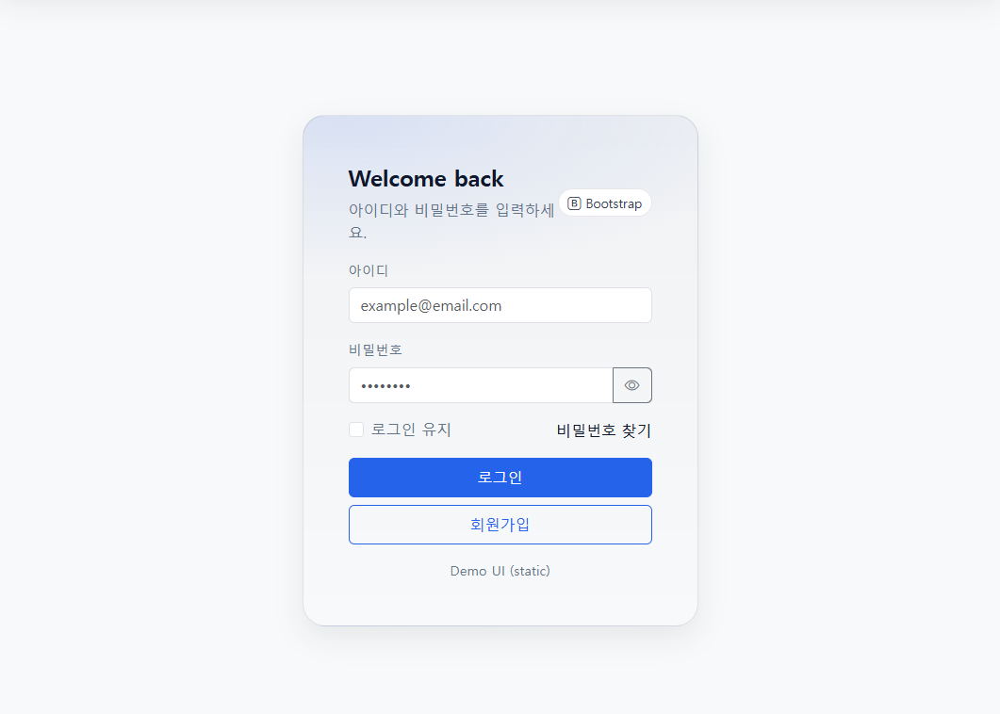
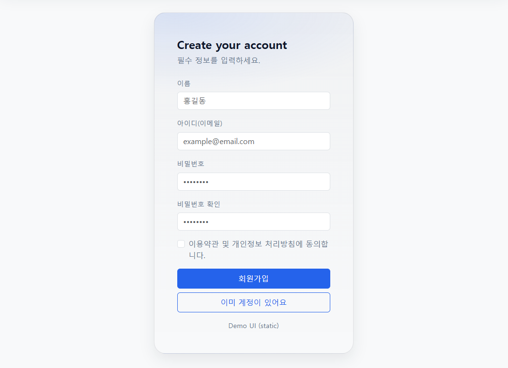
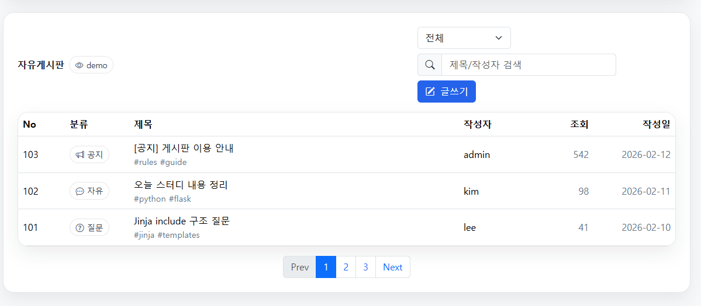
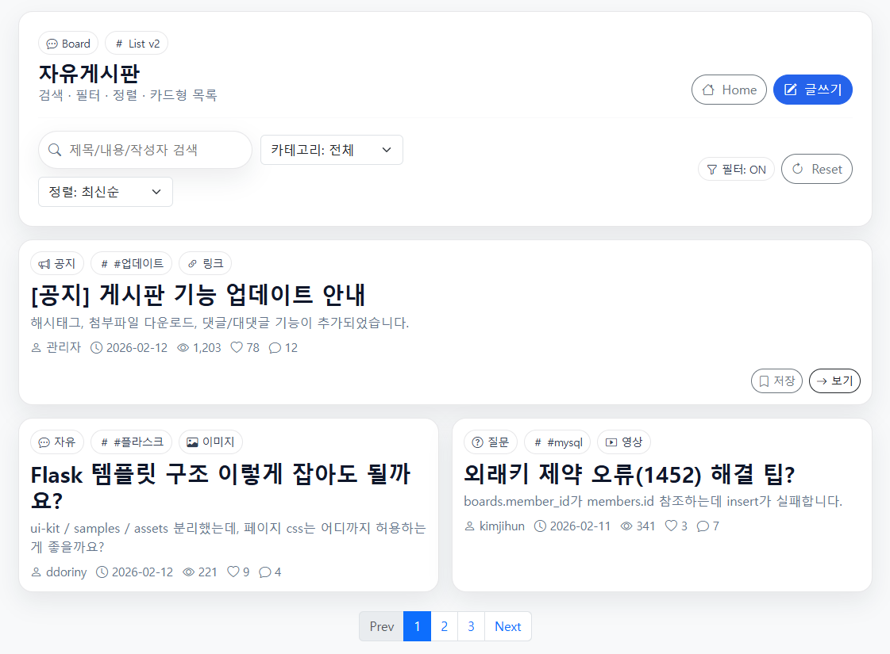
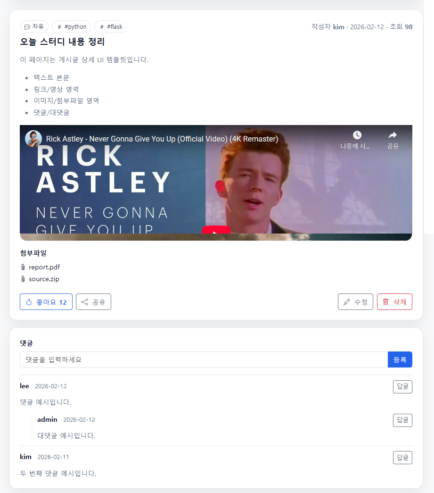
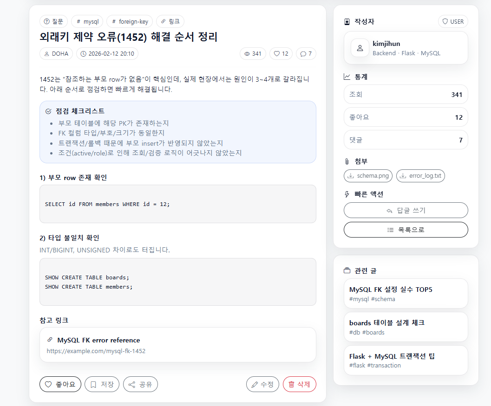
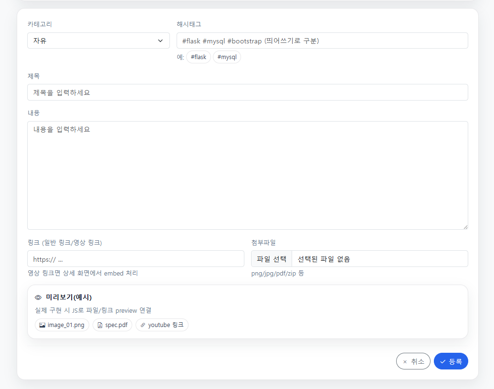
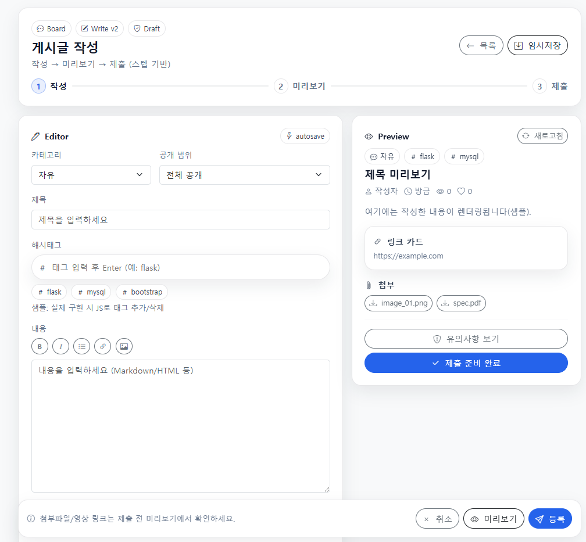

# Frontend UI Portfolio

Bootstrap 기반 화면 레이아웃 + UI 컴포넌트 설계 포트폴리오 저장소입니다.  
페이지 단위 샘플을 제작하고, 반복 패턴을 분리하여  
**재사용 가능한 UI Kit (Design System)** 으로 확장하는 것을 목표로 합니다.

단순 페이지 모음이 아니라  
**Samples → Components → Patterns → UI Kit Docs → Versioning(v1/v2)** 구조로 설계되어 있습니다.

---

# Project Summary

| 항목 | 내용 |
|------|------|
| Purpose | UI 레이아웃 + 컴포넌트 시스템 설계 |
| Method | Sample → Pattern → Component → UI Kit |
| Framework | Bootstrap 5 |
| Output | UI Templates + UI Kit Docs |
| Versioning | v1 / v2 확장 구조 |


---

# Quick Start

- **Portfolio Home** → `index.html`
- **UI Kit Docs** → `ui-kit/index.html`
- **Board Samples** → `samples/board/*`

정적 HTML 기반 — 브라우저에서 바로 열어서 미리보기 가능

---

# UI Samples

썸네일 클릭 시 실제 UI 페이지로 이동합니다.

## Auth

| Login v1 | Signup v1 |
|---|---|
| [](samples/auth/login-v1.html) | [](samples/auth/signup-v1.html) |

---

## Dashboard

| Dashboard v1 |
|---|
| [](samples/dashboard/dashboard-v1.html) |

---

## Board (v1 / v2 Variants)

게시판 UI를 **레이아웃 v1 → 패턴 확장 v2**로 리디자인한 샘플입니다.  
v2는 필터, 사이드 패널, 액션 그룹, 카드형 정보 구조를 추가했습니다.

### List

| List v1 | List v2 |
|---|---|
| [](samples/board/board-list-v1.html) | [](samples/board/board-list-v2.html) |

### Detail

| Detail v1 | Detail v2 |
|---|---|
| [](samples/board/board-detail-v1.html) | [](samples/board/board-detail-v2.html) |

### Write

| Write v1 | Write v2 |
|---|---|
| [](samples/board/board-write-v1.html) | [](samples/board/board-write-v2.html) |


---

# UI Kit Documentation

UI Kit은 **토큰 → 컴포넌트 → 패턴 → 버전 확장(v2)** 계층으로 구성됩니다.

---

## Foundations

| 문서 | 설명 |
|------|------|
| tokens.html | 디자인 토큰 |
| tokens-v2.html | 토큰 확장 / 테마 전략 |

---

## Components

| 문서 | 설명 |
|------|------|
| buttons.html | 버튼 v1 |
| buttons-v2.html | 버튼 variants / size / icon |
| cards.html | 카드 v1 |
| cards-v2.html | 카드 패턴 확장 |
| forms.html | 입력 UI |
| tables.html | 테이블 UI |
| avatars.html | 프로필 UI |

---

## Patterns

| 문서 | 설명 |
|------|------|
| topbar.html | 상단 네비게이션 |
| topbar-v2.html | 확장 네비게이션 |
| sidebar.html | 사이드바 |
| kanban-board.html | 칸반 보드 |
| kanban-board-v2.html | 고급 패턴 v2 |

---

# Design System Structure

- theme.css → 디자인 토큰
- components.css → 재사용 컴포넌트
- pages/*.css → 페이지 전용 스타일
> 스타일을 3계층으로 분리합니다.

**페이지 로드 순서:**

```html
<link rel="stylesheet" href="assets/css/theme.css">
<link rel="stylesheet" href="assets/css/components.css">
<link rel="stylesheet" href="assets/css/pages/xxx.css">
```
---
# Repository Structure
```
frontend-ui-portfolio/
├─ index.html
├─ assets/
│  ├─ css/
│  │  ├─ theme.css
│  │  ├─ components.css
│  │  └─ pages/
│  ├─ js/
│  └─ img/previews/
│
├─ samples/
│  ├─ auth/
│  ├─ dashboard/
│  ├─ todo/
│  ├─ board/
│  └─ shop/
│
└─ ui-kit/
   ├─ index.html
   ├─ foundations/
   ├─ components/
   └─ patterns/
```

---

# Design Workflow
**1.** 페이지 템플릿 제작 (Samples)
**2.** 반복 UI 패턴 식별
**3.** 공통 블록 추출
**4.** 컴포넌트화
**5.** UI Kit 문서화
**6.** v2 확장 (Variants / Patterns)
**7.** 재사용 및 템플릿화

---

# Versioning Strategy
| Version | 의미                       |
| ------- | ------------------------ |
| v1      | 기본 레이아웃                  |
| v2      | 패턴 확장 / variants / 구조 개선 |
>v2는 v1을 제거하지 않고
>확장 레이어로 유지합니다.

---

# Tech Stack
- HTML5 / CSS3
- Bootstrap 5
- Bootstrap Icons
- Vanilla JavaScript

---

# Usage
정적 HTML 기반 프로젝트입니다.
```index.html``` 또는 각 ```samples``` 페이지를 브라우저에서 열어 확인할 수 있습니다.

---

# Author
**DDORINY**
UI Layout · Component System · Design Pattern Portfolio
